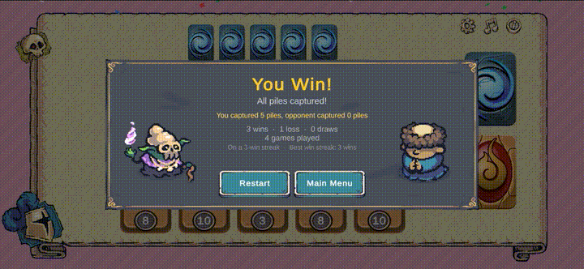
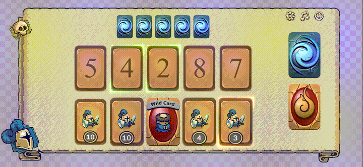
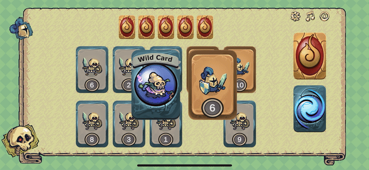

Hi, I'm Arianne,

I'm a developer from the UK  with 10+ years of software and web experience currently focused on Game development.

Featured Projects

<table>
<tr>
<td width="50%">

## Bomb Shelter Finder App
Mobile app that helps users locate nearby bomb shelters during emergencies. Runs off a custom map server. Features a user selected city map download and bundled SQLite shelter database so it works offline. The location service logic ensures that battery use is kept as effcient as possible. 

The project was designed and built with security and efficiency in mind. 

Repo is kept private for security reasons.

Tech: Flutter, Geolocation, Map APIs

Find it here → [Miklat Map](https://miklatmap.com)

</td>
<td width="25%">

</td>
<td width="25%">

</td>
</tr>
</table>
<table>
<tr>
<td width="50%">

## Crown Duel
A competitive twist on the classic Spit card game. 

Choose your faction and battle for control of the shared card piles by place cards 1 higher or 1 lower than the current value. Take over the most piles, or instantly win by capturing them all. 

Wild cards can be played on any pile at any time. 

Designed as a quick, replayable mobile game. Short rounds, strong feedback, clean UI, special cards and fun animations. 

- Faction selection screen with animated character previews
- Win by majority control or total domination
- Wild cards that can be played on any pile
- Game over cinematics with feedback driven transactions
- Persistent settings (SFX/music/faction selection)
- Player tracking (wins/losses/streaks/sessions)

Tech: Unity, C#
Coming soon to Apple and Android
</td>
<td width="50%">

</td>
</tr>
</table>
<table>
<tr>
<td width="50%">

## Retro Runner
A 2D Runner where the player can phase in and out while everything gets faster. 

- Procedurally generated scrolling terrain with layered sine wave hills
- Character select screen with animated previews
- Game over cinematic, your character topples over and zooms to the results screen
- Parallax star background, scanline overlay, camera shake on hit
- Music and SFX volume controls with persistent settings
- Streak counter with combo tracking

Tech: Unity, C#

<!--Find the code here → [CodeBase](https://github.com/ariannedev/hills-of-hillington)-->
Play the game here → [Itch.io](https://ariannedev.itch.io/phase-runner)
</td>
<td width="50%">

</td>
</tr>
</table>

