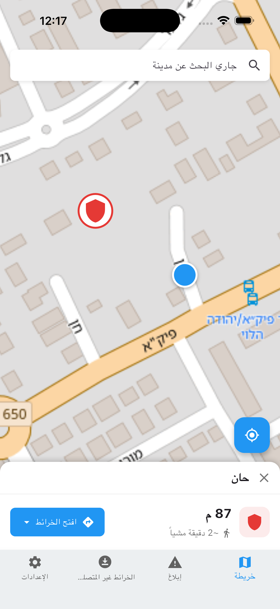
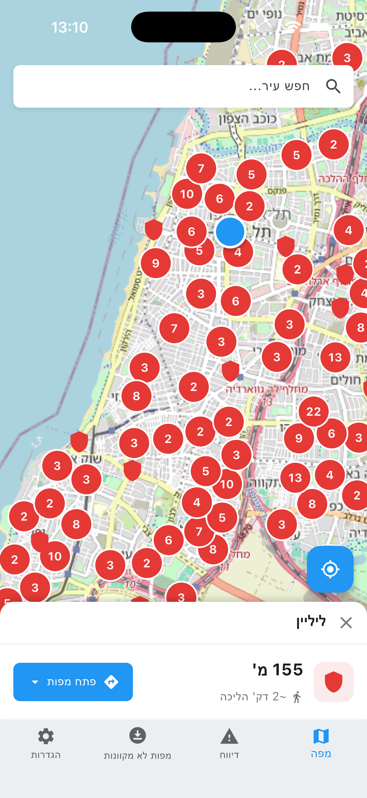
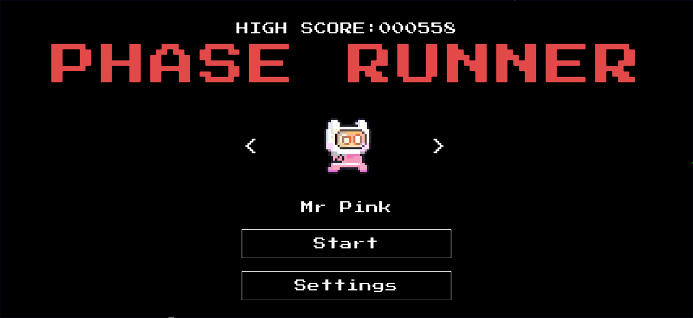
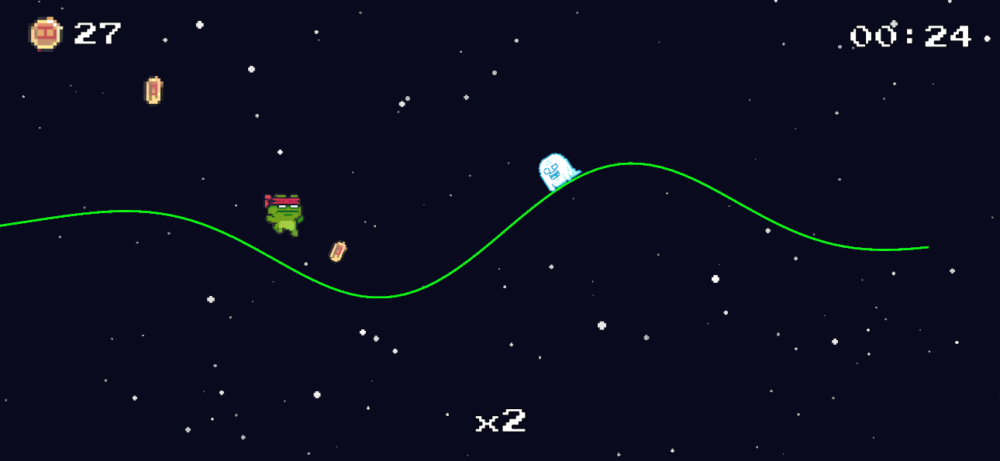

Hi, I'm Arianne,

I'm a developer from the UK with 10+ years of software and web experience currently focused on Game development.

🚀 Featured Projects

<table>
<tr>
<td width="50%">

## Bomb Shelter Finder App
Mobile app that helps users locate nearby bomb shelters during emergencies. Runs off a custom map server. Features a user selected city map download and bundled SQLite shelter database so it works offline. Location services ensure that battery use is kept as effcient as possible. 

The project was designed and built with security and efficiency in mind. 

Repo is kept private for security reasons.

Tech: Flutter, Geolocation, Map APIs

Find it here → [Miklat Map](https://miklatmap.com)

</td>
<td width="25%">

</td>
<td width="25%">

</td>
</tr>
</table>

<table>
<tr>
<td width="50%">

## Retro Runner
A 2D Runner where the player can phase in and out while everything gets faster. 

Tech: Unity, C#

Find the code here → [CodeBase](https://github.com/ariannedev/hills-of-hillington)
</td>
<td width="50%">

</td>
</tr>
</table>

Play the game here → [Itch.io](https://ariannedev.itch.io/phase-runner)
